# UTS { Pertemuan ke 8} 

## Profil
|  |  |
| -------- | --- |
| **Nama** | Raditra Ikhwanul Arifin |
| **Kelas** | TI.23.A.5 |
| **Mata Kuliah** | Pemrograman Web 1 |

# Membuat Website-Dinamis

## Langkah-Langkah

## 1. Membuat file website-dinamis
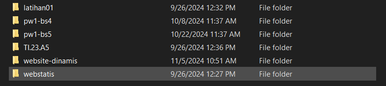
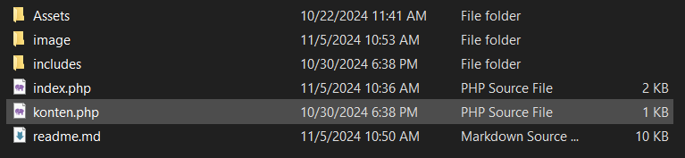
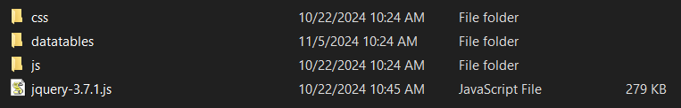

## 2. Menjalankan MySQL Server

Menjalankan MySQL dari menu **XAMPP Control.**

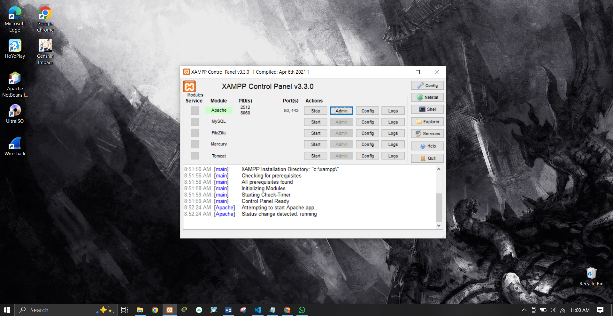

### Mengakses Apache Client menggunakan 'website-dinamis'.

Pastikan webserver Apache sudah dijalankan. Kemudian untuk mengakses direktory tersebut pada web server dengan mengakses URL : http://localhost/website-dinamis/?page=home/

## 3. Membuat index : membuat website-dinamis

### Membuat tampilan didalam

```
<!doctype html>
<html lang="en">

<head>
    <meta charset="utf-8">
    <meta name="viewport" content="width=device-width, initial-scale=1">
    <title>Bootstrap demo</title>
    <!-- Bootstrap -->
    <link href="Assets/css/bootstrap.min.css" rel="stylesheet">

    <!-- Datatables -->
    <link href="Assets/datatables/dataTables.bootstrap5.css" rel="stylesheet">
</head>

<body>
    <header>
    <meta charset="UTF-8">
    <meta name="viewport" content="width=device-width, initial-scale=1.0">
    <title>Graffiti Text</title>
    <!-- Link font Russo One dari Google Fonts -->
    <link href="https://fonts.googleapis.com/css2?family=Russo+One&display=swap" rel="stylesheet">
    <style>
        /* Styling untuk teks graffiti */
        .graffiti-text {
            font-family: 'Russo One', sans-serif;
            font-size: 3em;
            color: #333;
            text-shadow: 3px 3px 5px rgba(0, 0, 0, 0.5);
            text-align: center;
            margin-top: 50px;
        }
    </style>
</head>
<body>
    <!-- Teks yang ingin diubah menjadi gaya graffiti -->
    <h1 class="graffiti-text">website dinamis</h1>
</body>
</html>
        <!-- navbar -->
        <?php include "includes/navbar.php" ?>
        <!-- ./navbar -->

        <!-- konten -->
        <div class="container mt-3">
            <?php include "konten.php"?>
        </div>
        <!-- konten -->

        <script src="Assets/jquery-3.7.1.js"></script>
        <script src="Assets/js/bootstrap.bundle.min.js"></script>
        <script src="Assets/datatables/dataTables.js"></script>
        <script src="Assets/datatables/dataTables.bootstrap5.js"></script>

        <script>
        new DataTable('#example');
        </script>

</body>

</html>
```

### Menambahkan Data navabar

```
<nav class="navbar bg-dark navbar-expand-md bg-body-tertiary" data-bs- theme="dark">

    <div class="container-fluid">
        <a class="navbar-brand" href="?page=home">Navbar</a>
        <button class="navbar-toggler" type="button" data-bs-toggle="collapse" data-bs-target="#navbarSupportedContent"
            aria-controls="navbarSupportedContent" aria-expanded="false" aria- label="Toggle navigation">

            <span class="navbar-toggler-icon"></span>
        </button>
        <div class="collapse navbar-collapse" id="navbarSupportedContent">
            <ul class="navbar-nav me-auto mb-2 mb-lg-0">
                <li class="nav-item">
                    <a class="nav-link active" aria-current="page" href="?page=home">Home</a>
                </li>
                <li class="nav-item">
                    <a class="nav-link" href="?page=about">About</a>
                </li>
                <li class="nav-item">
                    <a class="nav-link" href="?page=contact">Contact</a>
                </li>

                <li class="nav-item dropdown">
                    <a class="nav-link dropdown-toggle" href="#" role="button" data-bs-toggle="dropdown"
                        aria-expanded="false">
                        Belajar
                    </a>
                    <ul class="dropdown-menu">
                        <li><a class="dropdown-item" href="?page=datatables">Datatables</a></li>

                        <li><a class="dropdown-item" href="?page=form">form</a></li>

                        <li>
                            <hr class="dropdown-divider">
                        </li>
                        <li><a class="dropdown-item" href="#">Something else here</a></li>

                    </ul>
                </li>
            </ul>
            <form class="d-flex" role="search">
                <input class="form-control me-2" type="search" placeholder="Search" aria-label="Search">

                <button class="btn btn-outline-success" type="submit">Search</button>

            </form>
        </div>
    </div>
</nav>

<nav class="navbar bg-body-tertiary">
    <form class="container-fluid">
        <div class="input-group">
            <span class="input-group-text" id="basic-addon1">@</span>
            <input type="text" class="form-control" placeholder="Username" aria-label="Username"
                aria-describedby="basic-addon1">
        </div>
    </form>
</nav>
```

***Output Ketika Berhasil :***

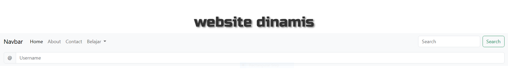


## 3. Menambahkan Home

dengan memasukan card dari https://getbootstrap.com/docs/5.3/components/card/

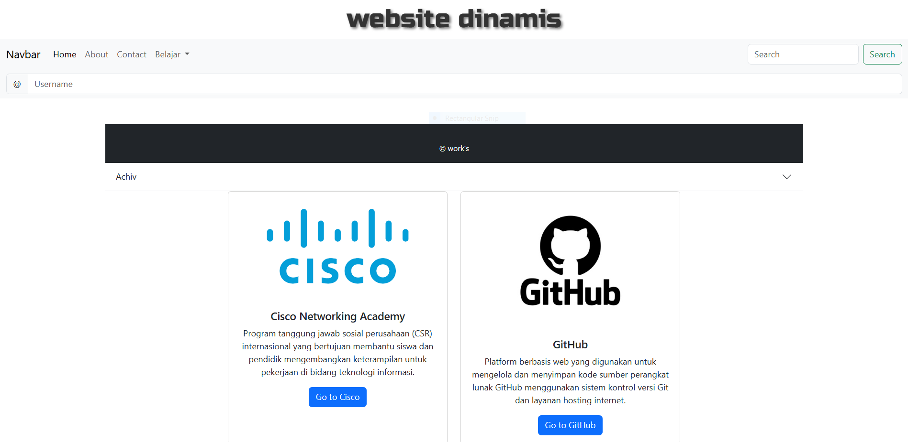
```
<footer class="bg-dark text-white text-center py-3 mt-5">
    <div class="container">
        <div class="row justify-content-center">
            <div class="col-auto text-center mt-3">
                <small>&copy; work's</small>
            </div>
        </div>
    </div>
</footer>

<div class="accordion accordion-flush" id="accordionFlushExample">
    <div class="accordion-item">
        <h2 class="accordion-header">
            <button class="accordion-button collapsed" type="button" data-bs-toggle="collapse"
                data-bs-target="#flush-collapseOne" aria-expanded="false" aria-controls="flush-collapseOne">
                Achiv
            </button>
        </h2>
        <div id="flush-collapseOne" class="accordion-collapse collapse" data-bs-parent="#accordionFlushExample">
            <div class="accordion-body"><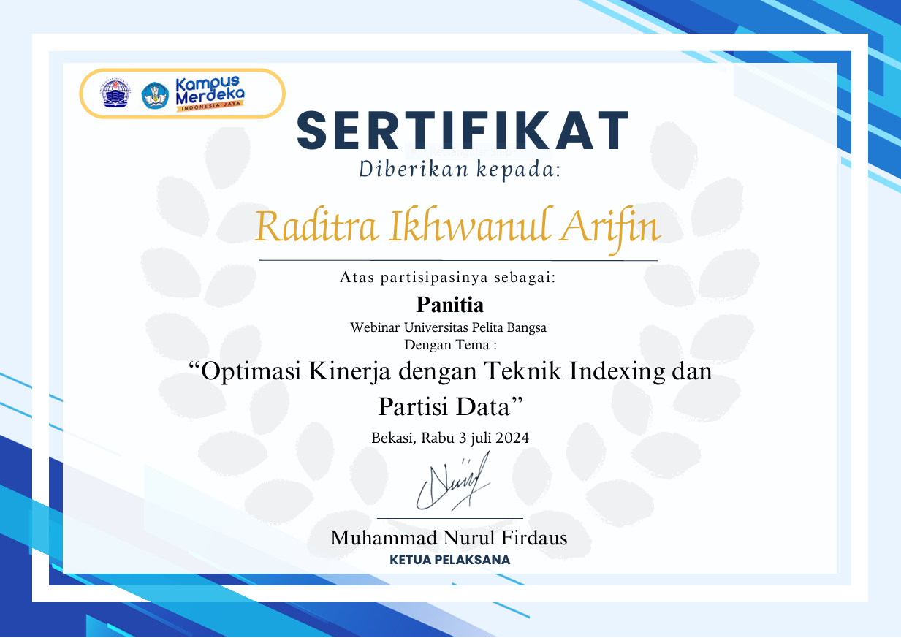</div>
        </div>
    </div>

<div class="container">
    <div class="row justify-content-center">
        <div class="col-md-4 d-flex justify-content-center">
            <div class="card text-center">
                
                <div class="card-body">
                    <h5 class="card-title">Cisco Networking Academy</h5>
                    <p class="card-text">Program tanggung jawab sosial perusahaan (CSR) internasional yang bertujuan membantu siswa dan pendidik mengembangkan keterampilan untuk pekerjaan di bidang teknologi informasi.</p>
                    <a href="https://www.netacad.com/courses/networking-basics?courseLang=en-US" class="btn btn-primary">Go to Cisco</a>
                </div>
            </div>
        </div>
        <div class="col-md-4 d-flex justify-content-center">
            <div class="card text-center">
                
                <div class="card-body">
                    <h5 class="card-title">GitHub</h5>
                    <p class="card-text">Platform berbasis web yang digunakan untuk mengelola dan menyimpan kode sumber perangkat lunak GitHub menggunakan sistem kontrol versi Git dan layanan hosting internet.</p>
                    <a href="https://github.com/Raditra-ikhwanul-arifin" class="btn btn-primary">Go to GitHub</a>
                </div>
            </div>
        </div>
    </div>
</div>

```
## 4. Menambahkan About
dengan memasukan image dan carousel dari https://getbootstrap.com/docs/5.3/components/card/

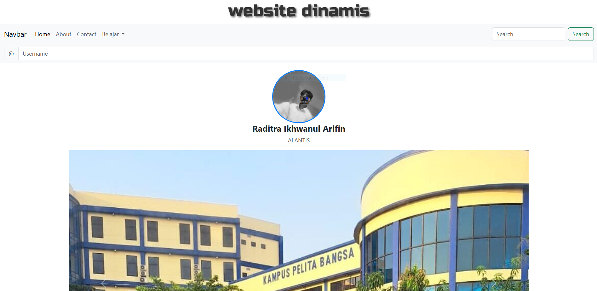

## 5. Menambahkan Contant
dengan memasukan halaman contact 

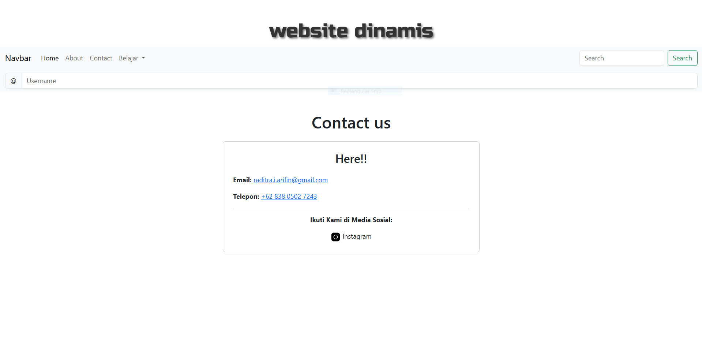
```
<!DOCTYPE html>
<html lang="en">

<head>
    <meta charset="UTF-8">
    <meta name="viewport" content="width=device-width, initial-scale=1.0">
    <title>Contact</title>
    <link rel="stylesheet" href="https://cdnjs.cloudflare.com/ajax/libs/bootstrap/5.3.0/css/bootstrap.min.css">
</head>

<body>

    <div class="container mt-5">
        <h1 class="text-center">Contact us</h1>
        <div class="row justify-content-center mt-4">
            <div class="col-md-6">
                <div class="card p-4">
                    <h3 class="text-center">Here!!</h3>
                    <div class="contact-info mt-3">
                        <p><strong>Email:</strong> <a href="mail:raditra.i.arifin@gmail">raditra.i.arifin@gmail.com</a></p>
                        <p><strong>Telepon:</strong> <a href="tel:+6283805027243">+62 838 0502 7243</a></p>
                        <hr>
                        <p class="text-center"><strong>Ikuti Kami di Media Sosial:</strong></p>
                        <div class="d-flex justify-content-around">
                            <a href="https://instagram.com/raditrrvn_" target="_blank"
                                class="text-decoration-none text-dark">
                                 Instagram
                        </div>
                    </div>
                </div>
            </div>
        </div>
    </div>

    <script src="Assets/js/bootstrap.bundle.min.js"></script>
</body>

</html>
```
## Membuat Datatables di belajar
membrikan skrip unuk datatables.php yang mengacu pada: https://datatables.net/examples/basic_init/zero_configuration.html

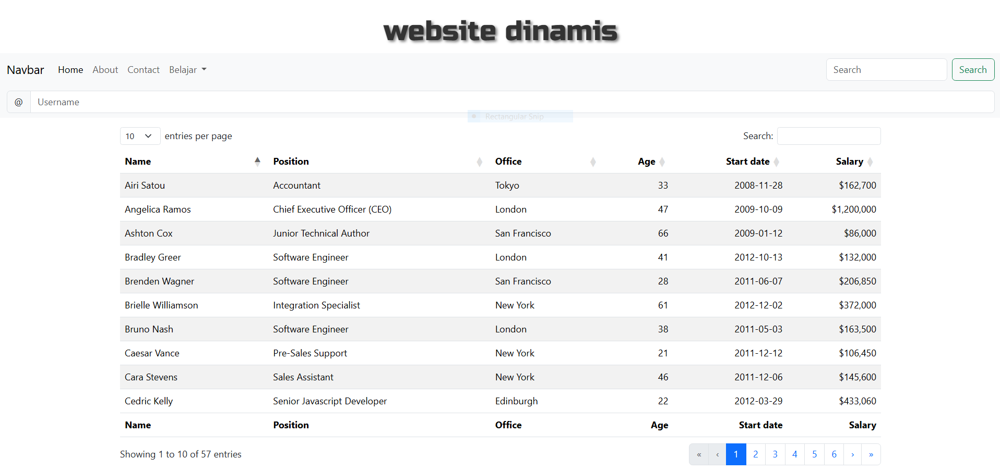
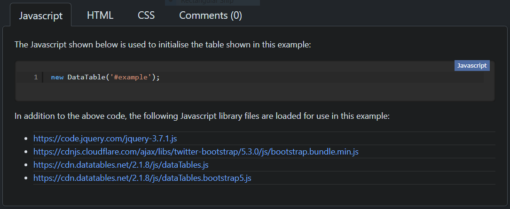
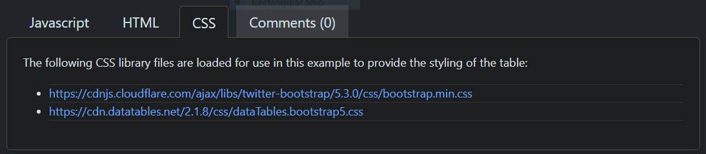

## Membuat form di belajar
dengan menambahkan form dari https://getbootstrap.com/docs/5.3/forms/overview/#overview

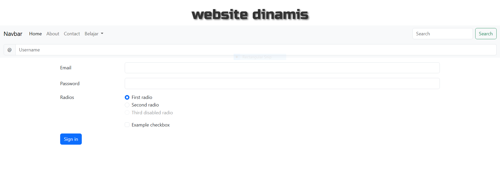


## SELESAI  
